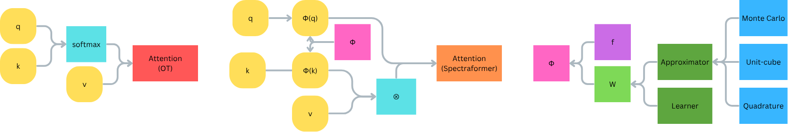
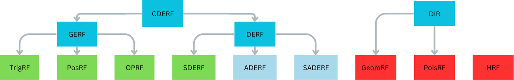
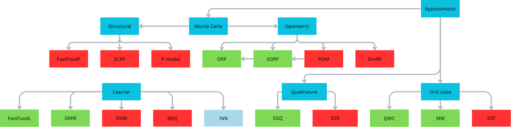

# Spectraformer

<p align="center">
<a href="#Features">Features</a> • <a href="#install">Installation</a> • <a href="#usage">Usage</a> • <a href="#benchmark">Algorithms</a> • <a href="#License">License</a>
<br>
</p>

*Spectraformer* a unified random feature framework for transformer for approximating and learning the kernel function in linearized attention of the Transformer. It allows for the combination of any weight matrix with any component function. This repository is the official implementation of Spectraformer

<!--  -->


## Features
Spectraformer evaluates different combinations of weight matrices and component functions in the Transformer in three textual tasks in the LRA benchmark.

The component functions we currently cover are checked by green ticks
<!--  -->


The weight matrices we currently cover are checked by green ticks
<!--  -->


## Installation

### Preparing the Code
To install requirements in a conda environment:
<!-- https://medium.com/@crismunozv/installing-custom-python-version-in-vertex-ai-eb9b1463e023 -->
<!-- Can also use python=3.12 -->
```
conda create -y -n spectraformer python=3.12
conda activate spectraformer
conda install torchquad -c conda-forge
conda install pytorch torchvision torchaudio pytorch-cuda=11.8 -c pytorch -c nvidia
pip install -r requirements.txt
```

<!-- If cannot install transformers -->
<!-- https://github.com/huggingface/transformers/issues/2831 -->
<!-- curl --proto '=https' --tlsv1.2 -sSf https://sh.rustup.rs | sh
source $HOME/.cargo/env
Then reinstall transformers -->

Note: Specific requirements for data preprocessing are not included here.

### Preparing the Dataset

Processed files can be downloaded [here](https://drive.google.com/drive/folders/1rE0SjpeFKPFtgmWWjYCoIMz91UozHWWC?usp=sharing), or processed with the following steps:

1. Requirements
```
tensorboard>=2.3.0
tensorflow>=2.3.1
tensorflow-datasets>=4.0.1
```
2. Download [the TFDS files for pathfinder](https://storage.cloud.google.com/long-range-arena/pathfinder_tfds.gz) and then set _PATHFINER_TFDS_PATH to the unzipped directory (following https://github.com/google-research/long-range-arena/issues/11)
3. Download [lra_release.gz](https://storage.googleapis.com/long-range-arena/lra_release.gz) (7.7 GB).
4. Unzip `lra-release` and put under `./data/`.
```
cd data
wget https://storage.googleapis.com/long-range-arena/lra_release.gz
tar zxvf lra-release.gz 
```
5. Create a directory `lra_processed` under `./data/`.
```
mkdir lra_processed
cd ..
```
6.The directory structure would be (assuming the root dir is `code`)
```
./data/lra-processed
./data/long-range-arena-main
./data/lra_release
```
7. Create train, dev, and test dataset pickle files for each task.
```
cd preprocess
python create_pathfinder.py
python create_listops.py
python create_retrieval.py
python create_text.py
python create_cifar10.py
```

Note: most source code comes from [LRA repo](https://github.com/google-research/long-range-arena).

## Usage

Modify the configuration in `config.py` and run
```
python main.py --mode train --attn skyformer --task lra-text
```
- mode: `train`, `eval`
- attn: `softmax`, `nystrom`, `linformer`, `reformer`, `perfromer`, `informer`, `bigbird`,  `kernelized`, `skyformer`
- feat: `trigrf`, `posrf`, `oprf`, `gerf`, `saderf`
- kernel_type: `gaus`, `orf`, `scrf`, `sorf`, `rom`, `sgq`, `qmc`, `mm`, `fastfood_fixed`, `fastfood_learnable`
- task: `lra-listops`, `lra-pathfinder`, `lra-retrieval`, `lra-text`, `lra-image`

To run experiments on GCP
```
pip install --upgrade google-cloud-storage

python main.py --mode eval --attn skyformer --task lra-text --bucket_name kernelized-transformer-code --blob_path kernelized-transformer/data/lra_processed
```

## Research
To incorporation a new component function or weight matrix, please satisfy the following requirement and follow the instruction.

### Component Function

**Requirement**: Component function `f` must satisfy $\mathbb{E}_\omega[f(x)f(y)] = K(x,y)$

**Code implementation**
- Add the new component function `f` to `src/models/component_functions.py`, the arguments should include data (the input), and other optional parameters.
- Import `f` and add a new entry to `FastAttention.comp_functions[f_name] = f` in `src/models/attention_performer.py` (line 176)

### Weight Matrix

**Requirement**: Weight matrix `W` must either be an approximator or a learner, as an approximator. As an approximator, it must provide unbiased or nearly unbiased estimation of a kernel k i.e., 

$$\mathbb{E}_\omega[f(x)f(y)] = K(x,y), W = [\omega_1, .. \omega_s]^T, f = TrigRF$$

A learner simply needs to parameterize a distribution `p`.

**Code implementation**
- Add the new weight matrix w to `src/models/weight_matrix_approx.py` or `src/models/weight_matrix_learner.py`, the arguments should include `nb_rows` (number of rows), `nb_cols` (number of columns) and `device`.
- Import `w` and add the if clause and `w` function call in `src/models/attention_performer.py` (line 208)

## Algorithms

|                  | Accuracy (\%) $\uparrow$ |              |              |              |              |       | Time (hour) $\downarrow$ |      |      |      |      |       | Memory (GB) $\downarrow$ |       |      |      |      |       |
|------------------|:------------------------:|:------------:|:------------:|:------------:|:------------:|:-----:|:------------------------:|:----:|:----:|:----:|:----:|:-----:|:------------------------:|:-----:|:----:|:----:|:----:|:-----:|
|                  |             L            |       T      |       R      |       I      |       P      | $\mu$ |             L            |   T  |   R  |   I  |   P  | $\mu$ |             L            |   T   |   R  |   I  |   P  | $\mu$ |
| Nystromformer    |       38.69 (0.59)       | 61.57 (0.38) | 80.57 (0.30) | 39.49 (0.89) | 69.96 (1.27) | 58.06 |           0.56           | 0.90 | 1.00 | 2.19 | 1.19 |  1.17 |           1.10           |  1.87 | 1.84 | 5.55 | 2.79 |  2.63 |
| Big Bird         |       38.82 (0.52)       | 61.04 (0.15) | 80.53 (0.32) | 37.59 (1.04) | 68.28 (6.74) | 57.25 |           1.60           | 3.17 | 3.24 | 5.72 | 2.89 |  3.32 |           2.24           |  4.57 | 3.80 | 8.42 | 4.22 |  4.65 |
| OPRF-FastFoodL   |       37.73 (0.28)       | 64.32 (0.61) | 78.65 (1.94) | 38.41 (0.66) | 66.76 (0.39) | 57.17 |           1.07           | 2.07 | 2.11 | 4.02 | 2.05 |  2.26 |           0.84           |  1.68 | 1.64 | 3.26 | 1.68 |  1.82 |
| Reformer         |       35.50 (4.09)       | 61.28 (0.45) | 78.31 (0.29) | 43.62 (0.81) | 66.28 (2.35) | 57.00 |           0.65           | 1.29 | 1.29 | 2.51 | 1.26 |  1.40 |           1.61           |  3.20 | 2.95 | 6.38 | 3.20 |  3.47 |
| Skyformer        |       38.96 (0.63)       | 60.67 (0.45) | 81.90 (0.37) | 32.93 (0.39) | 69.81 (1.38) | 56.85 |           0.78           | 1.35 | 1.49 | 3.09 | 1.63 |  1.67 |           1.67           |  3.01 | 2.92 | 7.90 | 3.96 |  3.89 |
| OT               |       38.49 (0.80)       | 59.72 (1.07) | 80.86 (0.20) | 37.48 (0.83) | 67.56 (6.12) | 56.82 |           1.96           | 7.27 | 7.07 | 4.30 | 2.20 |  4.56 |           4.37           | 16.72 | 8.74 | 9.42 | 4.72 |  8.79 |
| OPRF-SGQ         |       37.08 (0.56)       | 61.09 (0.77) | 79.39 (0.94) | 36.68 (0.28) | 67.53 (2.79) | 56.35 |           0.68           | 1.27 | 1.25 | 2.46 | 1.29 |  1.39 |           1.33           |  2.64 | 2.50 | 5.25 | 2.64 |  2.87 |
| PosRF-MM         |       37.13 (0.27)       | 62.88 (1.17) | 80.58 (0.44) | 33.82 (0.51) | 67.11 (0.45) | 56.30 |           0.56           | 1.05 | 1.06 | 2.02 | 1.05 |  1.15 |           1.14           |  2.26 | 2.05 | 4.49 | 2.26 |  2.44 |
| OPRF-OR          |       38.05 (0.78)       | 60.18 (0.49) | 81.19 (0.23) | 33.70 (0.57) | 67.24 (0.88) | 56.07 |           0.68           | 1.26 | 1.24 | 2.47 | 1.29 |  1.39 |           1.33           |  2.64 | 2.50 | 5.25 | 2.64 |  2.87 |
| SADERF-QMC       |       37.18 (0.47)       | 60.61 (2.06) | 80.67 (0.44) | 34.55 (0.63) | 67.32 (0.40) | 56.07 |           0.68           | 1.24 | 1.28 | 2.47 | 1.26 |  1.39 |           1.40           |  2.79 | 2.63 | 5.56 | 2.79 |  3.04 |
| PosRF-QMC        |       37.05 (0.16)       | 60.93 (0.59) | 80.67 (0.29) | 34.03 (0.94) | 67.25 (0.44) | 55.99 |           0.55           | 1.05 | 1.05 | 1.99 | 1.05 |  1.14 |           1.14           |  2.26 | 2.05 | 4.49 | 2.26 |  2.44 |
| OPRF-QMC         |       37.86 (0.40)       | 60.87 (1.85) | 80.44 (0.20) | 33.87 (0.69) | 66.81 (0.68) | 55.97 |           0.68           | 1.26 | 1.24 | 2.43 | 1.28 |  1.38 |           1.33           |  2.64 | 2.50 | 5.25 | 2.64 |  2.87 |
| SADERF-ORF       |       37.41 (0.45)       | 59.92 (0.90) | 81.05 (0.18) | 33.06 (1.02) | 67.11 (0.56) | 55.71 |           0.69           | 1.25 | 1.28 | 2.50 | 1.28 |  1.40 |           1.40           |  2.79 | 2.63 | 5.56 | 2.79 |  3.04 |
| OPRF-MM          |       38.31 (0.38)       | 60.01 (1.01) | 81.03 (0.31) | 33.93 (0.85) | 65.17 (5.17) | 55.69 |           0.68           | 1.26 | 1.29 | 2.47 | 1.28 |  1.40 |           1.33           |  2.64 | 2.50 | 5.25 | 2.64 |  2.87 |
| SADERF-MM        |       37.17 (0.27)       | 60.81 (1.82) | 81.05 (0.20) | 34.03 (1.04) | 65.31 (4.85) | 55.67 |           0.69           | 1.25 | 1.28 | 2.49 | 1.28 |  1.40 |           1.40           |  2.79 | 2.63 | 5.56 | 2.79 |  3.04 |
| SADERF-SGQ       |       37.22 (0.28)       | 62.86 (0.96) | 78.51 (0.68) | 37.82 (0.59) | 61.27 (5.38) | 55.54 |           0.68           | 1.25 | 1.28 | 2.50 | 1.27 |  1.39 |           1.40           |  2.79 | 2.63 | 5.56 | 2.79 |  3.04 |
| SADERF-FastFoodL |       29.72 (7.27)       | 64.71 (0.45) | 77.50 (0.96) | 38.38 (0.82) | 66.47 (1.47) | 55.35 |           1.09           | 2.09 | 2.18 | 4.05 | 2.06 |  2.29 |           0.90           |  1.80 | 1.76 | 3.52 | 1.80 |  1.96 |
| PosRF-FastFoodL  |       29.54 (5.46)       | 64.61 (0.29) | 77.10 (1.02) | 38.28 (0.43) | 66.38 (0.71) | 55.18 |           1.02           | 2.00 | 2.01 | 3.88 | 1.98 |  2.18 |           0.77           |  1.54 | 1.50 | 3.01 | 1.54 |  1.67 |
| PosRF-ORF        |       34.50 (6.49)       | 61.10 (1.76) | 80.53 (0.33) | 33.72 (1.03) | 65.52 (4.89) | 55.07 |           0.56           | 1.05 | 1.06 | 2.02 | 1.06 |  1.15 |           1.14           |  2.26 | 2.05 | 4.49 | 2.26 |  2.44 |
| OPRF-SORF        |       29.59 (3.77)       | 64.81 (0.22) | 77.12 (0.78) | 37.42 (0.47) | 63.98 (5.38) | 54.58 |           0.68           | 1.26 | 1.24 | 2.42 | 1.28 |  1.38 |           1.33           |  2.64 | 2.50 | 5.25 | 2.64 |  2.87 |
| SADERF-SORF      |       34.31 (2.50)       | 64.82 (0.26) | 75.24 (1.12) | 36.76 (1.22) | 60.98 (4.90) | 54.42 |           0.68           | 1.25 | 1.28 | 2.47 | 1.26 |  1.39 |           1.40           |  2.79 | 2.63 | 5.56 | 2.79 |  3.04 |
| Linformer        |       36.94 (0.60)       | 56.99 (1.23) | 77.86 (0.35) | 39.09 (0.78) | 59.24 (5.84) | 54.02 |           0.41           | 0.74 | 0.77 | 1.28 | 0.71 |  0.78 |           0.86           |  1.70 | 1.61 | 3.39 | 1.71 |  1.85 |
| PosRF-SGQ        |       28.81 (7.77)       | 62.30 (0.47) | 78.31 (0.39) | 37.96 (0.76) | 59.71 (7.87) | 53.42 |           0.56           | 1.06 | 1.05 | 2.01 | 1.06 |  1.15 |           1.14           |  2.26 | 2.05 | 4.49 | 2.26 |  2.44 |
| Informer         |       31.45 (7.20)       | 62.06 (1.20) | 76.92 (0.14) | 37.90 (0.30) | 57.07 (6.57) | 53.08 |           0.88           | 1.92 | 2.23 | 3.21 | 1.78 |  2.01 |           2.66           |  5.57 | 3.27 | 5.20 | 2.61 |  3.86 |
| PosRF-SORF       |       21.91 (5.98)       | 62.06 (1.36) | 66.33 (0.41) | 28.70 (3.87) | 52.37 (5.24) | 46.27 |           0.55           | 1.06 | 1.06 | 2.00 | 1.05 |  1.14 |           1.14           |  2.26 | 2.05 | 4.49 | 2.26 |  2.44 |

**References**

Krzysztof Marcin Choromanski, Valerii Likhosherstov, David Dohan, Xingyou Song, Andreea Gane, Tamas Sarlos, Peter Hawkins, Jared Quincy Davis, Afroz Mohiuddin, Lukasz Kaiser, David Benjamin Belanger, Lucy J Colwell, and Adrian Weller. Rethinking attention with performers. In International Conference on Learning Representations, 2021. URL https://openreview.net/forum?id=Ua6zuk0WRH.

Sankalan Pal Chowdhury, Adamos Solomou, Kumar Avinava Dubey, and Mrinmaya Sachan. Learning the transformer kernel. Transactions on Machine Learning Research, 2022. ISSN 2835-8856. URL https://openreview.net/forum?id=tLIBAEYjcv.

Valerii Likhosherstov, Krzysztof M Choromanski, Kumar Avinava Dubey, Frederick Liu, Tamas Sarlos, and Adrian Weller. Chefs'random tables: Non-trigonometric random features. In S. Koyejo, S. Mohamed, A. Agarwal, D. Belgrave, K. Cho, and A. Oh, editors, Advances in Neural Information Processing Systems, volume 35, pages 34559–34573. Curran Associates, Inc., 2022. URL https://proceedings.neurips.cc/paper_files/paper/2022/file/df2d62b96a4003203450cf89cd338bb7-Paper-Conference.pdf.

Valerii Likhosherstov, Krzysztof Marcin Choromanski, Kumar Avinava Dubey, Frederick Liu, Tamas Sarlos, and Adrian Weller. Dense-exponential random features: Sharp positive estimators of the gaussian kernel. In Thirty-seventh Conference on Neural Information Processing Systems, 2023. URL https://openreview.net/forum?id=S0xrBMFihS.


## License

Distributed under the MIT License. See `LICENSE.txt` for more information.

<p align="right">(<a href="#top">back to top</a>)</p>
